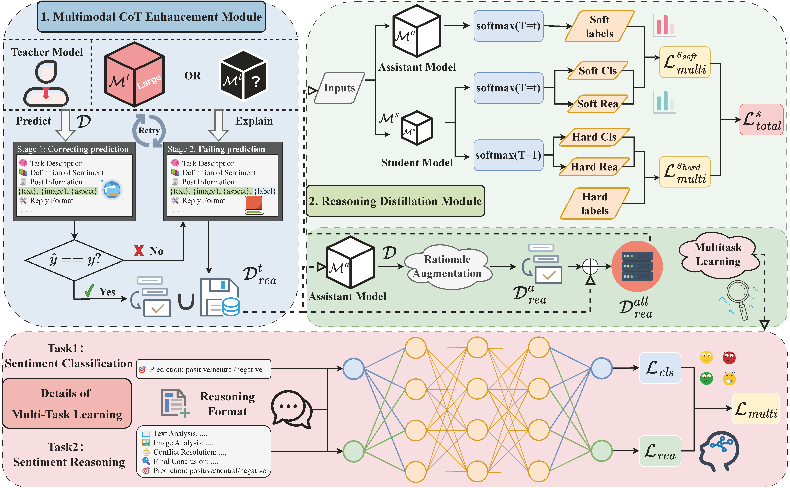

# MulCoT-RD

<p align="center">
    
</p>

<p align="center">
    🤗 <a href="https://71fa6862bec24a314a.gradio.live/">Demo (Developed based on Gradio)</a><br/> | 📄 <a href="https://arxiv.org/abs/2508.05234">Paper (arXiv:2508.05234)</a>
</p>

<h3 align="center">
  Resource-Limited Joint Multimodal Sentiment Reasoning and Classification <br/>
  via Chain-of-Thought Enhancement and Distillation
</h3>


## Overview


## Notice
- This repository provides the code and model resources for our paper on **arXiv**.
- Only a portion of the core code has been uploaded at present. The complete codebase will be made publicly available upon acceptance of the paper. Nevertheless, the existing code supports reproduction of our main results.
- This demo focuses on the **MASC** task and utilizes the Qwen2.5-VL-3B model fine-tuned based on the MulCoT-RD framework. Due to local deployment and limited computational resources, response times may occasionally be slow. We appreciate your understanding.

## Requirements
### Runtime environment
Please use the following command to set up your runtime environment:
```
conda env create -f environment.yml
```

### Datasets
All datasets used in this work are publicly available and can be found at the links below:
- **MVSA**:  [[ MVSA-Single + MVSA-Multiple ]](https://mcrlab.net/research/mvsa-sentiment-analysis-on-multi-view-social-data/)
- **MASC**:  [[ Twitter-2015 + Twitter-2017 ]](https://github.com/jefferyYu/TomBERT)

If you wish to quickly reproduce our work, you may start by downloading the images of the Twitter-2015 dataset from the link above and placing them under the `.data/T15/Images` directory. We provide CoT-augmented data for the T15 dataset.

### Model Download
- **[[ MulCoT-RD-7B ]](https://huggingface.co/sghn/MulCoT-RD-7B/tree/main)**
- **[[ MulCoT-RD-3B ]](https://huggingface.co/sghn/MulCoT-RD-3B/tree/main)**
- **[[ sentence-transformers/all-MiniLM-L6-v2 ]](https://huggingface.co/sentence-transformers/all-MiniLM-L6-v2)**

## Reproduction
Shell scripts are provided to facilitate a quick and easy start.

### Step1: Change the model path
Please place the downloaded **MulCoT-RD-7B** and **MulCoT-RD-3B** models in the following directories:

- `MulCoT-RD-7B` → `./logs/models/ftcot/Qwen_2.5_VL_72B/`
- `MulCoT-RD-3B` → `./logs/models/kd/Qwen_2.5_VL_72B/`

Please modify the image data and model loading paths in the following files:

- `./src/dataset.py`
- `./src/functions.py`

### Step2: Validate the Assistant model
```
bash shells/assistant_eval.sh
```

### Step3: Validate the Student model
```
bash shells/student_eval.sh
```
